# Plant-Species-Image-Classification

A. Project Overview:

This project is a classification of tropical plants specifically focuses on building dataset of different varieties of Philippine Orchids. The primary goal of this project is to collect and classify images about various orchid species to create a structured dataset that can be used for plant identification in machine learning applications. The classification includes multiple orchid varieties captured from different angles to ensure accuracy. 

#Purpose:

The purpose of this image classification model is to automatically identify and categorize different varieties of tropical orchids plants. By training the model, the system recognizes patterns such as the shape, color, and structure to accurately classify each orchid species. This will help reduce manual identification errors and provide a reliable source for future data analysis or AI-based plant recognition system.

## Embedded Screenshots Folders

- [Exported Teachable Machine Model Files](images/plants/images/exported-model-files)
- [Image Representatives](images/plants/images/image-representatives/)
- [Model Evaluation](images/plants/images/model-evaluation/)
- [Model Testing](images/plants/images/model-testing/)
- [Model Training Details](images/plants/images/model-training-details/)

## Plant Species Section

<table>
<tr>
<td align="center" width="33%">

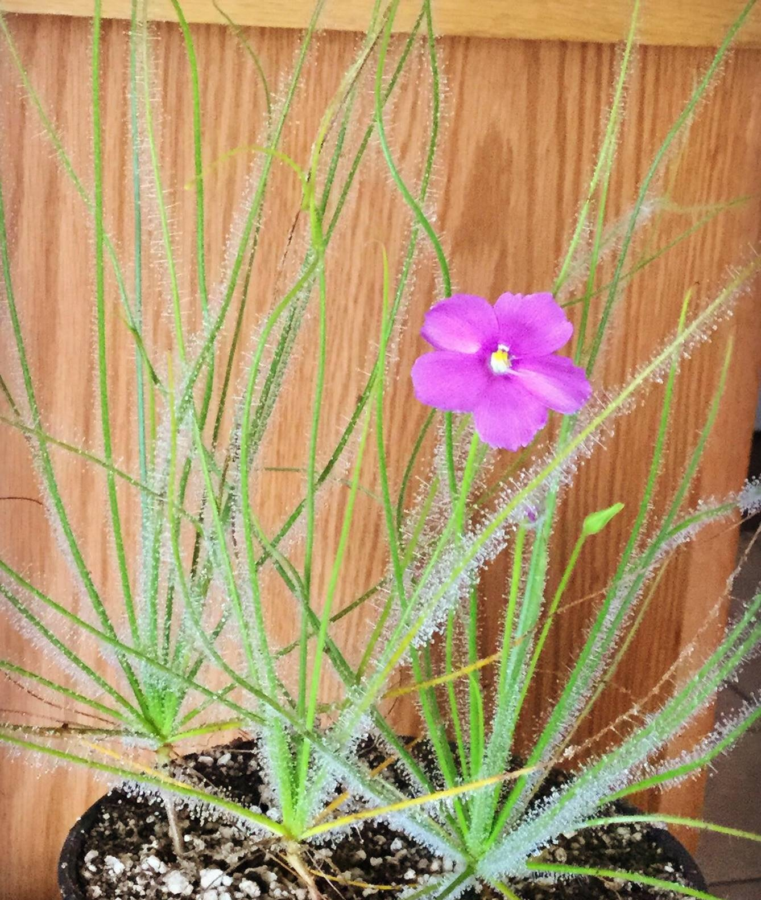  
<b>Common Name:</b> Rainbow Plant  
<b>Scientific Name: </b> <i>Byblis gigantea</i>   
<b>Description:</b> Byblis gigantea is a rare, perennial carnivorous plant endemic to Western Australia, characterized by its tall (up to 0.45-0.7 meters), sub-shrubby habit and sticky, mucilaginous leaves that trap insects.
</td>

<td align="center" width="33%">
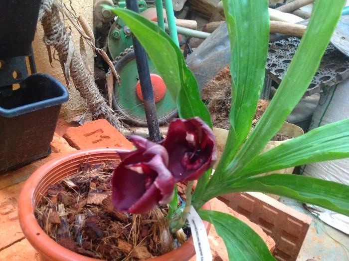  

<b>Common Name:</b> Catasetum 
<b>Scientific Name: </b><i>Catasetum callosum</i>   
<b>Description: </b>Catasetum (abbreviated Ctsm.) is a genus of roughly 200 species of showy, Neotropical epiphytic orchids native to Central and South America. They are highly prized for their unique, waxy, and often intensely fragrant flowers.

</td>

<td align="center" width="33%">

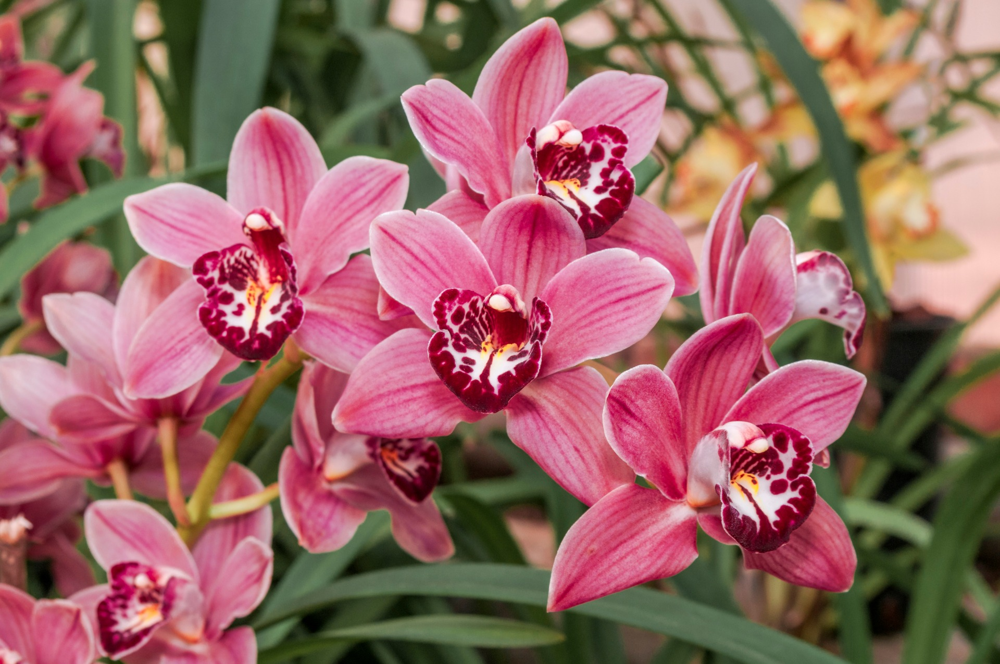  
<b>Common Name:</b>  Boat Orchid or Noble Orchid 
<b>Scientific Name:</b> <i>Cymbidium (Genus)</i>   
<b>Description:</b> Cymbidium orchids are a genus of approximately 55–80 species of evergreen, perennial, and epiphytic (tree-dwelling), lithophytic (rock-growing), or terrestrial (ground-growing) herbs. They are highly popular in horticulture, valued for their long, leathery, strap-like leaves and tall, dramatic, and enduring flower spikes. 

</td>
</table>

<table>
<tr>
<td align="center" width="33%">
  
<b>Common Name: </b>Dancing Lady Orchid/Dancing Doll Orchid/Golden Shower Orchid 
<b>Scientific Name: </b> <i>Oncidium genus</i>   
<b>Description:</b>Oncidium orchids are primarily epiphytic (growing on trees) and are native to the tropical and subtropical Americas. They are characterized by large, arching sprays or spikes filled with dozens of small, dainty, and often fragrant flowers.
</td>

<td align="center" width="33%">
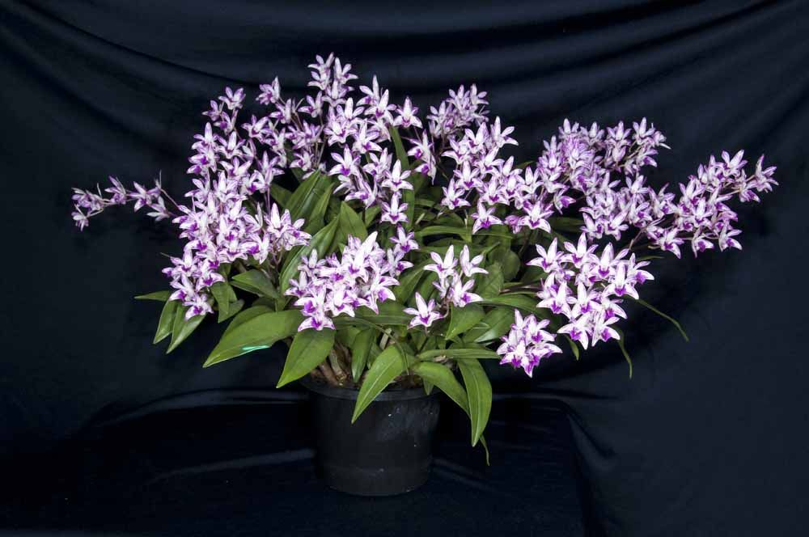  
<b>Common Name:</b> Dendrobium Orchid/Stalk Orchids 
<b>Scientific Name: </b> <i> Dendrobium </i>   
<b>Description: </b>Dendrobium is a large genus of about 1600 tropical and subtropical herbaceous perennials in the orchid family (Orchidaceae). They are native across a wide area from India, China and Japan to Australia, New Zealand and New Caledonia. The genus name comes from the Greek words dendron, meaning a tree, and bios, meaning life.

</td>

<td align="center" width="33%">

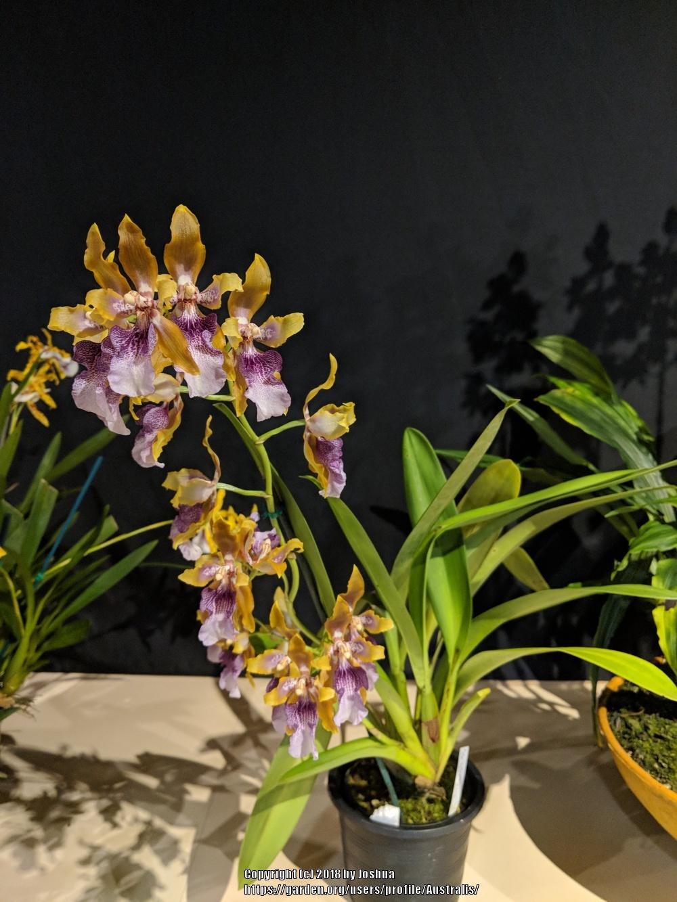  
<b>Common Name:</b> Butterfly Orchids, Long-lasting Spray Orchids  
<b>Scientific Name:</b> <i>Odontoglossum</i>   
<b>Description:</b>Odontoglossum, genus of some 150 species of orchids (family Orchidaceae) that are primarily native to mountainous areas of tropical America. Many Odontoglossum species and hybrids are cultivated for their showy long-lasting flowers and are considered fairly easy to grow. In addition, a number of orchids of other genera have been crossed with species of Odontoglossum to obtain novel hybrid flowers.

</td>
</table>

<table>
<tr>
<td align="center" width="33%">
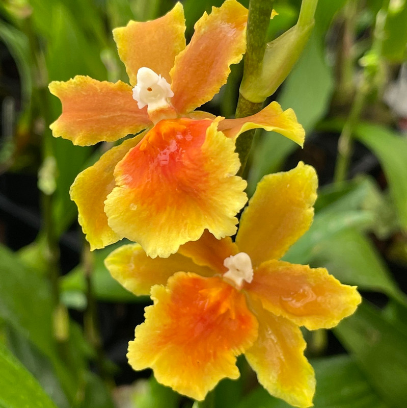  
<b>Common Name: </b>Red orchids, Designer orchids 
<b>Scientific Name: </b> <i>Oncostelopsis</i>   
<b>Description:</b> Oncostelopsis orchids are mid-sized, compact hybrid plants designed for vibrant color and high flower counts. They are often called "red orchids" or "designer orchids" because they combine the striking, often deep red or magenta, velvety colors and large lips of Miltoniopsis and Rhynchostele with the floriferous, spray-forming habit of Oncidium. 
</td>

<td align="center" width="33%">
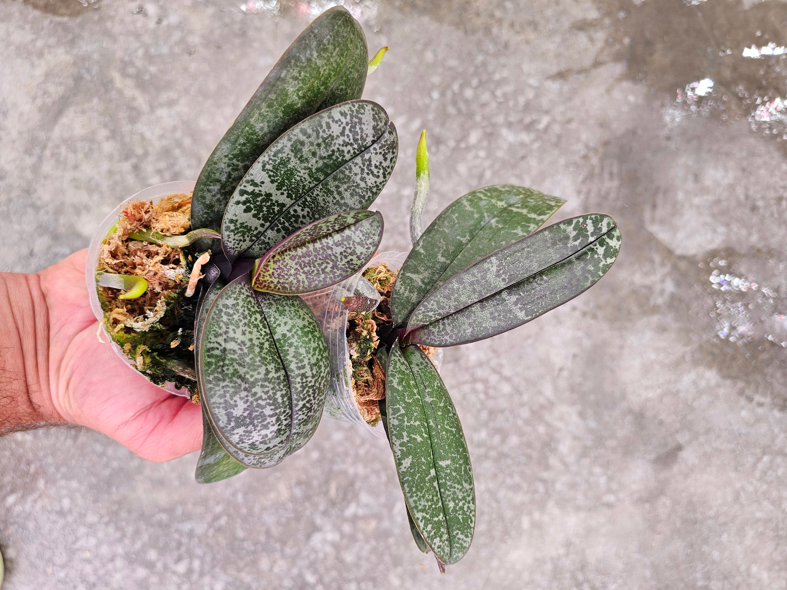  
<b>Common Name: </b>Butterfly Orchid, Moon orchid 
<b>Scientific Name: </b> <i>Phalaenopsis</i>   
<b>Description:</b>  Phalaenopsis is a genus of roughly 70 species of tropical epiphytic (or sometimes lithophytic) orchids known for their long-lasting, flat, and often fragrant flowers, which are arranged on tall, arching stems. Native to Southeast Asia, New Guinea, and Australia, they feature short stems, broad leathery leaves, and thick roots. Due to their ease of care and ability to bloom in low-light indoor environments for months at a time, they are among the most popular houseplants.

</td>

<td align="center" width="33%">
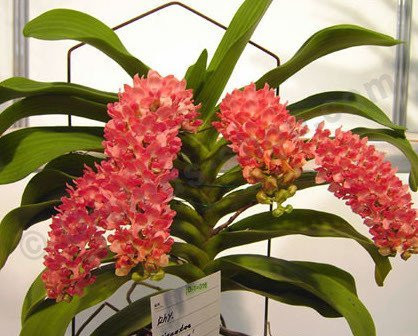  
<b>Common Name: </b>Foxtail Orchid 
<b>Scientific Name: </b> <i>Rhynchostylis retusa, Rhynchostylis gigantea, </i>   
<b>Description:</b>Rhynchostylis orchids, commonly known as Foxtail Orchids, are a small genus of highly fragrant, tropical, epiphytic orchids in the Vanda alliance. They are renowned for their long, densely packed, pendant racemes that resemble a fox's tail, usually blooming in winter to early spring.

</td>
</table>

<table>
<tr>
<td align="center" width="33%">
  
<b>Common Name: </b>Mrs. Javier's Vanda 
<b>Scientific Name: </b> <i>Vanda javierae </i>   
<b>Description:</b> anda javierae is a rare, endangered species of orchid endemic to the Philippines, specifically found in the Luzon and Calayan Island regions. It is a medium-sized, monopodial epiphyte that thrives in cool, high-elevation, humid environments (around 1200 meters), often near water sources.
</td>

<td align="center" width="33%">
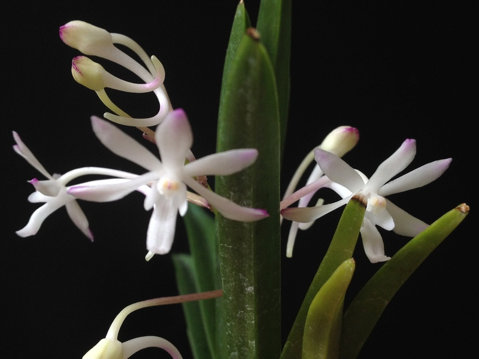  
<b>Common Name: </b>Baby Angel Orchid 
<b>Scientific Name: </b> <i>Vandachostylis Baby Angel</i>   
<b>Description:</b>  Vandachostylis Baby Angel is a popular, compact, and fragrant hybrid orchid registered in 1989. It is a primary cross between Vanda falcata (75% - formerly Neofinetia) and Vandachostylis Lou Sneary. It is highly prized for its ability to bloom multiple times a year, producing small, white, and intensely sweet-scented flowers. The plant is well-suited for hanging baskets, prefers bright, indirect light, and is generally easy to grow. 
</td>

<td align="center" width="33%">
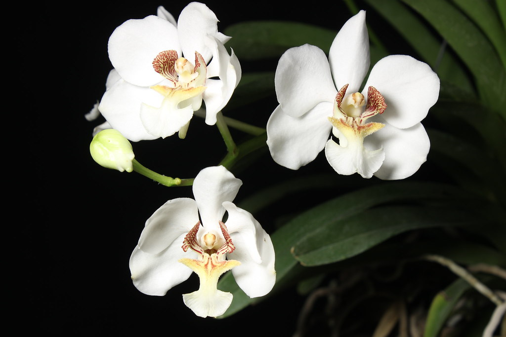  
<b>Common Name: </b>Barnes' Vanda 
<b>Scientific Name: </b> <i>Vanda barnesii </i>   
<b>Description:</b> Vanda barnesii is a rare, cool-growing, small-sized epiphytic orchid endemic to the high-elevation forests of northern Luzon in the Philippines. It was identified in 2012 and is characterized by its stiff, leathery (coriaceous) leaves and upright inflorescences (4.8 to 7.2 inches long) that bear up to 11 flowers. 

</td>
</table>

<table>
<tr>
<td align="center" width="33%">
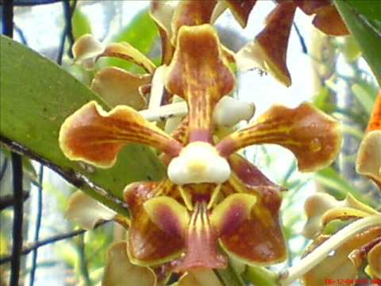  
<b>Common Name: </b>The Celebes Vanda 
<b>Scientific Name: </b> <i>Vanda Celebica Rolfe</i>   
<b>Description:</b> CAPTION HERE
</td>

<td align="center" width="33%">
  
<b>Common Name: </b>NAME HERE 
<b>Scientific Name: </b> <i>NAME HERE</i>   
<b>Description:</b>  Vanda celebica is a rare, epiphytic, and warm-growing orchid endemic to North Sulawesi, Indonesia. It is a medium-to-large, monopodial, clump-forming orchid with thin, decurved leaves and small, 3–4 cm wide flowers that are typically reddish-brown with greenish-yellow petals. The flowers are fragrant, featuring a lily-like scent that shifts to a cucumber aroma after a few weeks, blooming in the summer on short, few-flowered inflorescences. 
</td>

<td align="center" width="33%">
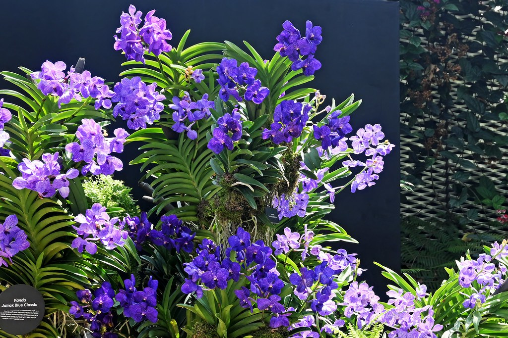  
<b>Common Name: </b>Jairak Blue 
<b>Scientific Name: </b> <i>Vanda coerulea</i>   
<b>Description:</b> The Vanda Jairak Blue (specifically Vanda Jairak Blue Classic) is a, renowned, high-quality, hybrid orchid originating from Thailand. It is highly popular for its deep blue-purple, long-lasting flowers.

</td>
</table>

<table>
<tr>
<td align="center" width="33%">
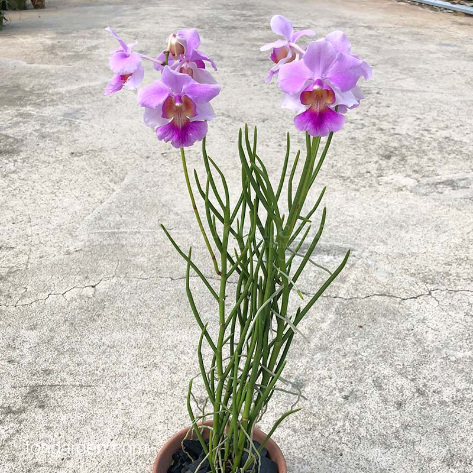  
<b>Common Name: </b>Princess Aloha Orchid 
<b>Scientific Name: </b> <i>Papilionanthe Miss Joaquim</i>   
<b>Description:</b> Papilionanthe Miss Joaquim is a vigorous, sun-loving, and free-flowering orchid hybrid that was chosen as Singapore's National Flower on April 15, 1981. It is characterized by its cylindrical or "pencil-like" leaves, which are adaptations that allow it to grow in full, direct sun.
</td>

<td align="center" width="33%">
  
<b>Common Name: </b>NAME HERE 
<b>Scientific Name: </b> <i>NAME HERE</i>   
<b>Description:</b> CAPTION HERE
</td>

<td align="center" width="33%">
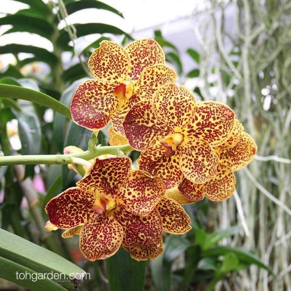  
<b>Common Name: </b>Vanda Kulwadee, Kulwadee Fragrance 
<b>Scientific Name: </b> <i>Vanda Kulwadee Fragrance</i>   
<b>Description:</b> Vanda Kulwadee Fragrance is a popular, award-winning, and highly fragrant Vanda orchid hybrid that originated in Thailand. It is renowned for its large, rounded blooms and intense scent—a rare feature among many modern Vanda hybrids.

</td>
</table>

<table>
<tr>
<td align="center" width="33%">
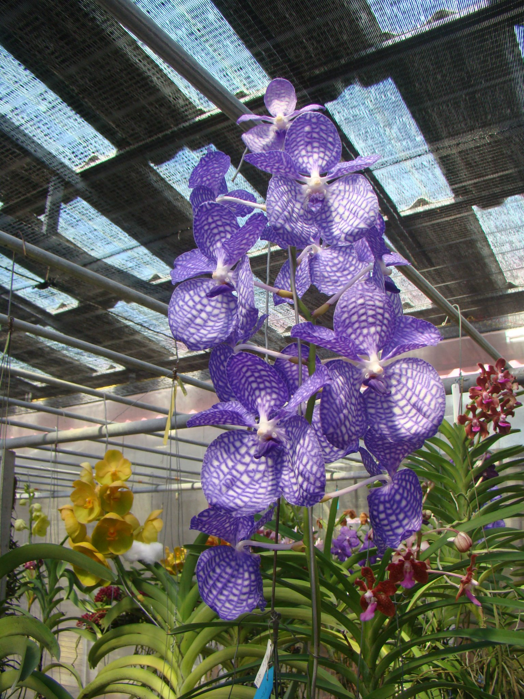  
<b>Common Name: </b>Ratchaburi Beauty, Ratchaburi Charming 
<b>Scientific Name: </b> <i> Vanda hybrid</i>   
<b>Description:</b>  These are epiphytic, monopodial orchids featuring large, thick, leathery, strap-shaped leaves and long, fleshy aerial roots. They are usually grown in wooden hanging baskets without potting medium.
</td>

<td align="center" width="33%">
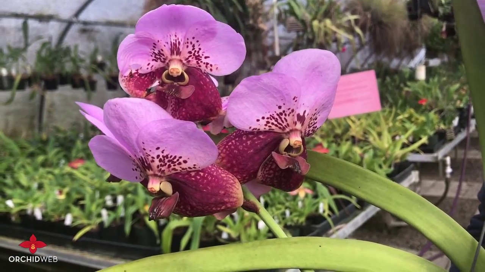  
<b>Common Name: </b>Waling-waling 
<b>Scientific Name: </b> <i>Vanda sanderiana</i>   
<b>Description:</b> Vanda sanderiana (Waling-waling) is a prestigious, large-sized Philippine orchid, often hailed as the "Queen of Philippine flowers". It is an epiphyte with long, leathery leaves and produces large (up to 11 cm), fragrant, and long-lasting flowers, typically featuring a pinkish-tan dorsal sepal/petals and yellow-maroon veined lateral sepals. 
</td>

<td align="center" width="33%">
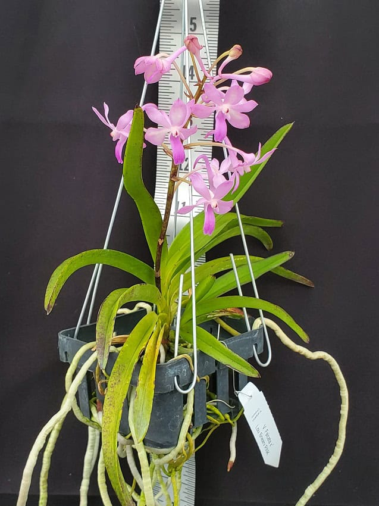  
<b>Common Name: </b>Vandachostylis Lou Sneary Pink 
<b>Scientific Name: </b> <i>Vandachostylis Lou Sneary</i>   
<b>Description:</b> Neostylis (Vandachostylis) Lou Sneary, perhaps the most popular Neofinetia hybrid of all time, is the cross of Neofinetia falcata and Rhynchostylis coelestis. Plants are vandaceous and may bloom multiple times a year. Flowers are white with blue/purple accents, and they are very fragrant.

</td>
</table>

<table>
<tr>
<td align="center" width="33%">
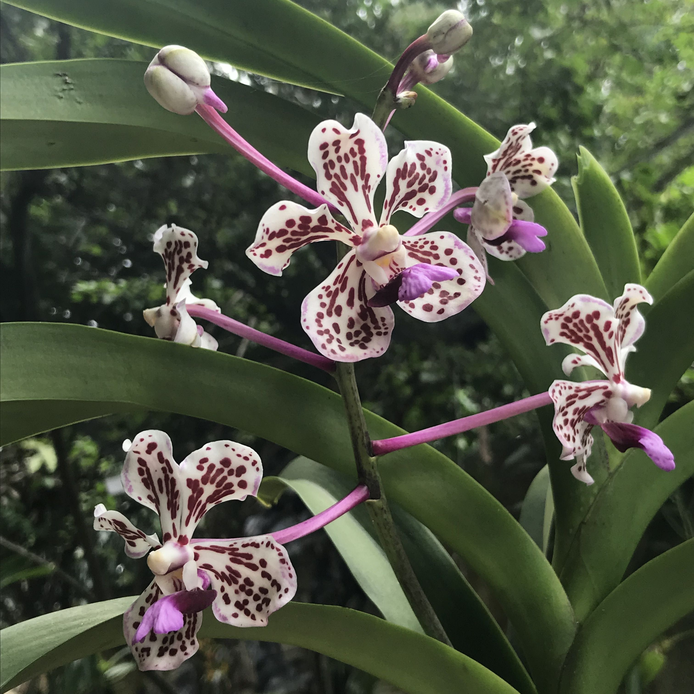  
<b>Common Name: </b>Tricolor Vanda, Soft Vanda, Three-colored Vanda 
<b>Scientific Name: </b> <i>Vanda tricolor Lindl.</i>   
<b>Description:</b> Vanda tricolor is a large, epiphytic, or sometimes terrestrial, monopodial orchid species native to Indonesia (Java, Bali, Lombok, Sumbawa) and Laos. It is highly valued for its tall, erect stems with leathery, strap-shaped leaves and its fragrant, long-lasting flowers.
</td>
</table>
