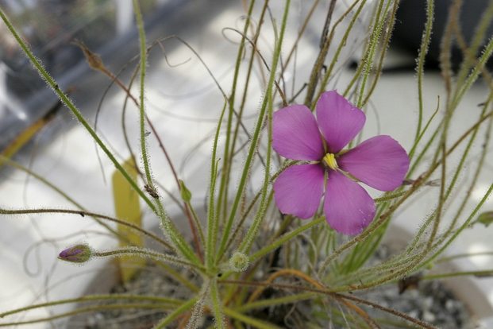
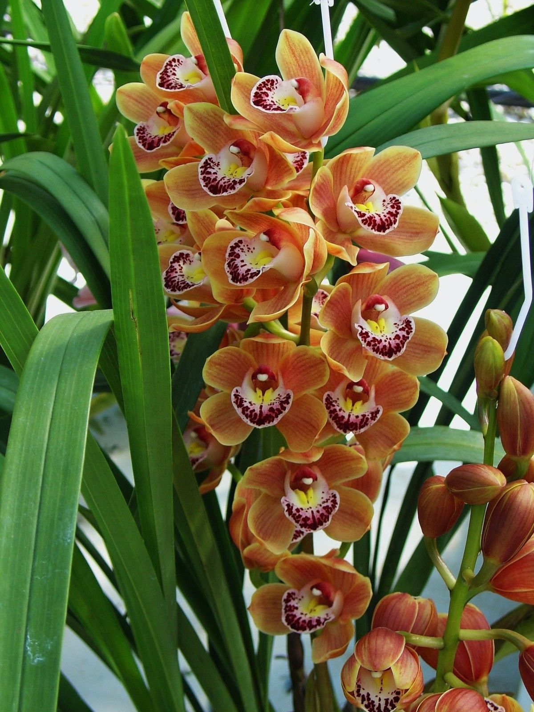
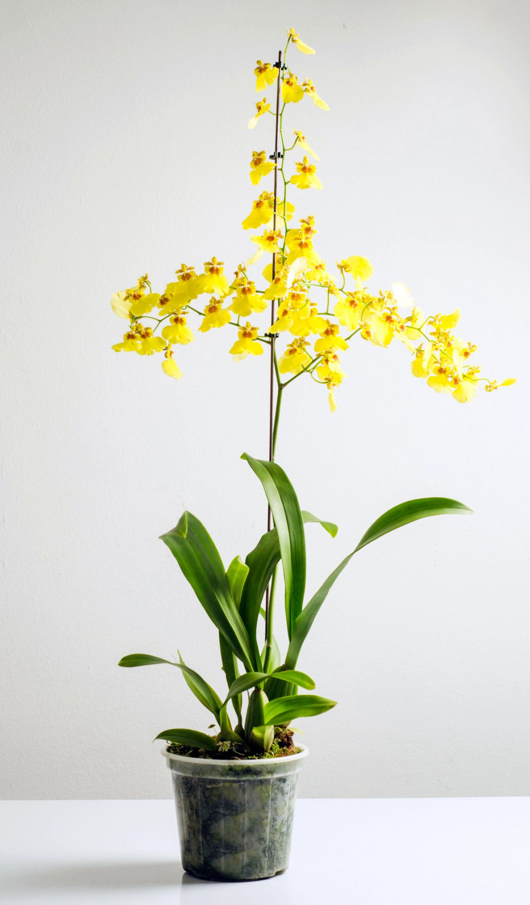
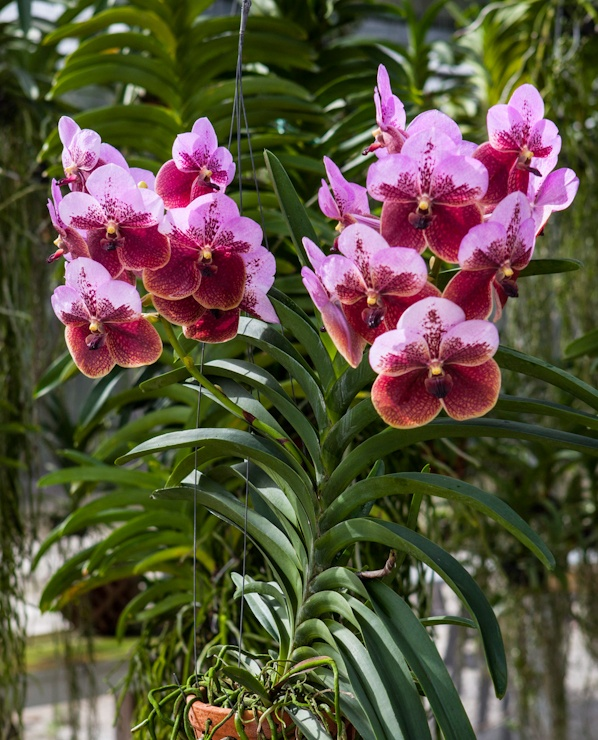
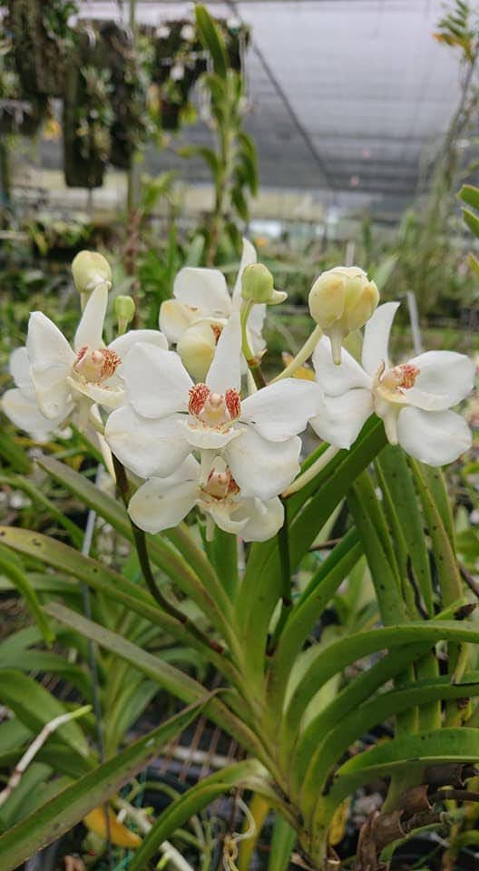
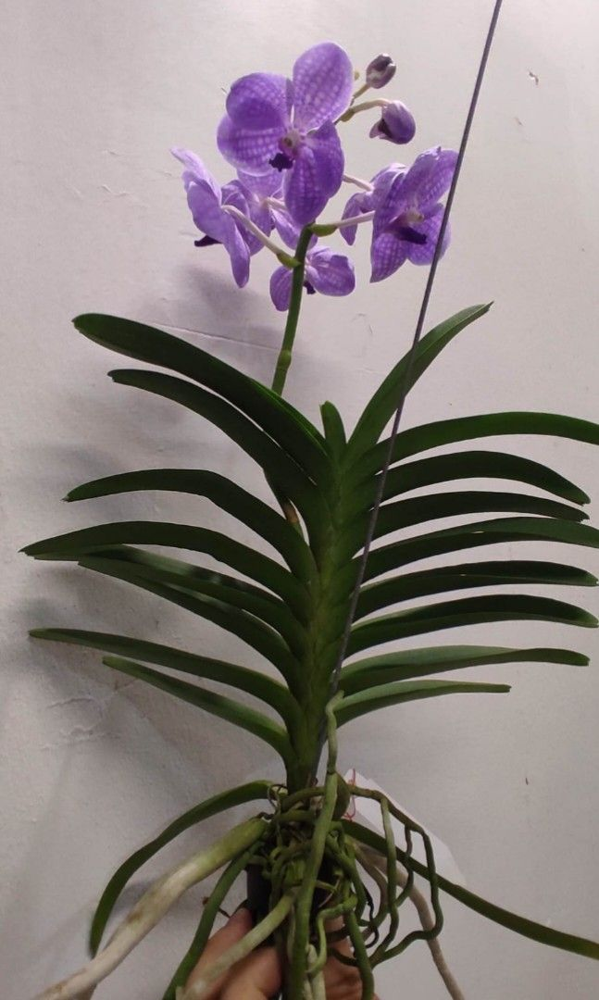
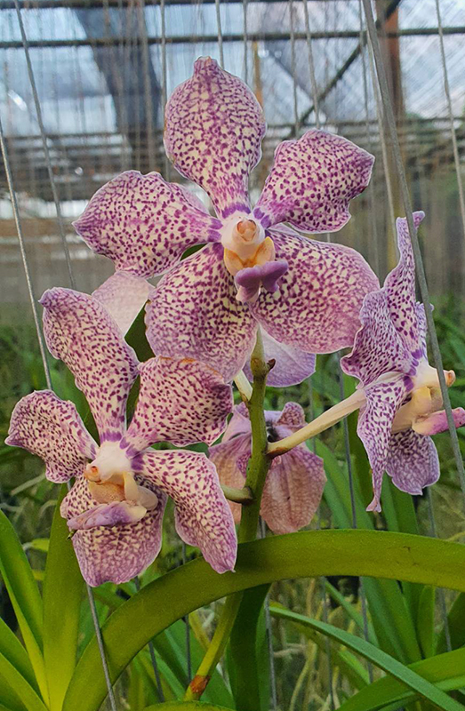

# Plant-Species-Image-Classification

A. Project Overview:

This project is a classification of tropical plants specifically focuses on building dataset of different varieties of Philippine Orchids. The primary goal of this project is to collect and classify images about various orchid species to create a structured dataset that can be used for plant identification in machine learning applications. The classification includes multiple orchid varieties captured from different angles to ensure accuracy. 

#Purpose:

The purpose of this image classification model is to automatically identify and categorize different varieties of tropical orchids plants. By training the model, the system recognizes patterns such as the shape, color, and structure to accurately classify each orchid species. This will help reduce manual identification errors and provide a reliable source for future data analysis or AI-based plant recognition system.

## 🌿 Byblis Gigantea

**Common Name:** Rainbow Plants  
**Scientific Name:** Byblis gigantea  

**Description:**  
Byblis gigantea is a carnivorous plant that traps insects using sticky leaves.

## 🌿 Cymbidium Orchid

**Common Name:** Boat Plants  
**Scientific Name:** Cymbidium  

**Description:**  
These orchids are known for their showy flowers and are popular in horticulture and and floral arrangements.

## 🌿 Dancing Lady Orchid

**Common Name:** Dancing Lady Orchid  
**Scientific Name:** Oncidium  

**Description:**  
These orchids are known for their intricate, frilly flowers that resemble a dancer's skirt, which is how they got their common name.

## 🌿 Vanda Baby Angel Orchid

**Common Name:** Vanda
**Scientific Name:** Vanda  

**Description:**  
These orchids are known for their vibrant colors and large, showy flowers, thriving in tropical and subtropical regions.

## 🌿 Vanda Barnesii Orchid

**Common Name:** White Vanda or White Orchid
**Scientific Name:** Vanda Barnesii  

**Description:**  
Vanda barnesii also called White Vanda or White Orchid is a small, fast-growing epiphytic orchid with a sprawling habit. It has white, fragrant flowers and long, narrow leaves. It is native to India, and is commonly found in tropical and subtropical climates in moist, shady habitats.

## 🌿 Vanda Jairak Blue Orchid

**Common Name:** Blue Orchid
**Scientific Name:** Vanda Coerulea

**Description:**  
This orchid is native to Northeast India and is known for its bluish-purple flowers that are long-lasting and can bloom multiple times a year. 

## 🌿 Vanda Kulwadee Fragrance Orchid

**Common Name:** Vanda Kulwadee Fragrance
**Scientific Name:** Vanda Gordon Dillon

**Description:**  
This orchid is known for its attractive fragrance and is often awarded for its beauty and quality. It is a popular choice among orchid enthusiasts due to its compact growth and the ability to produce multiple blooms throughout the growing season. 

